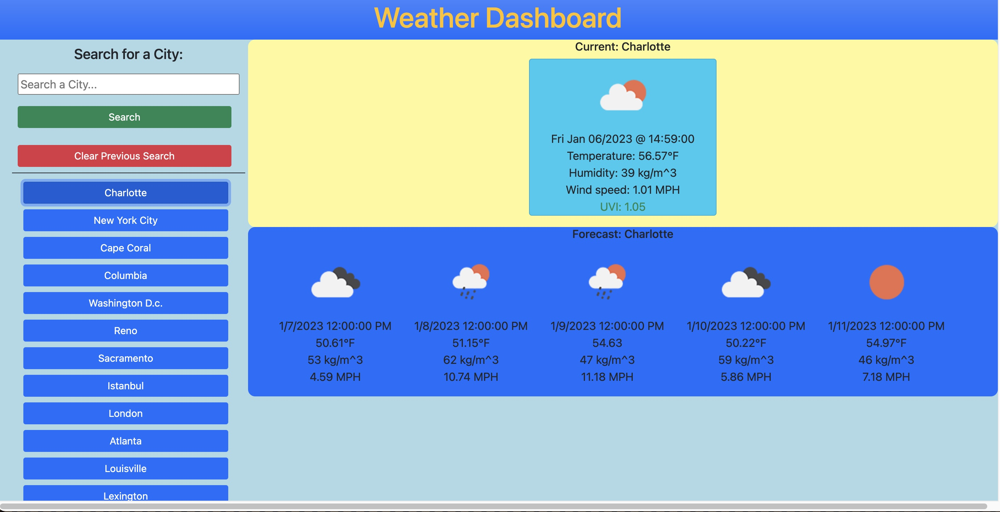

# weather-wonder

Description: 
This web application is a weather dashboard that serves the purpose of helping people plan out potential vacations. By using a third-party API (OpenWeatherAPI), the application is able to show the current weather and 5-day forecast of a given city. Using local storage, users are also able to save and view previous searches.

Link to Application: https://ejackson1228.github.io/weather-wonder/

